# [How to configure a B2B Integration and SFG environment using Gitops](https://developer.ibm.com/components/sterling/tutorials/) Tutorial

# Install IBM Sterling B2B Integrator / Sterling File Gateway using a GitOps workflow

<!--- cSpell:ignore gitorg YAMLs -->

# Step 1: Create Github Repository 

For using Gitops to install B2Bi and SFG, access to a GitHub account is required. 

1.	Login to your GitHub account
2.	Create a new free organization in GitHub (Follow screenshots below)

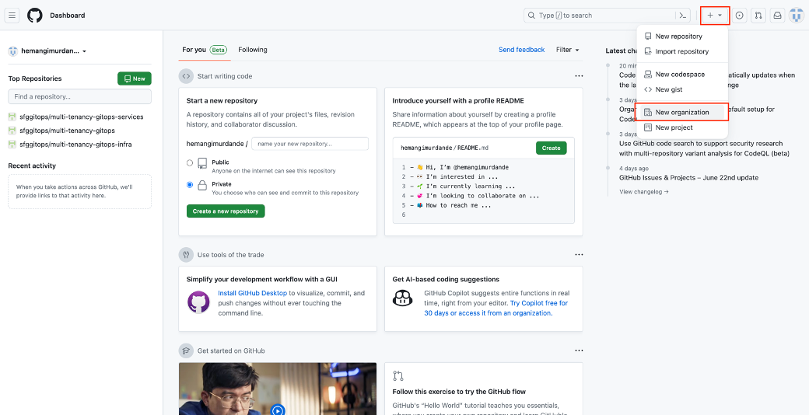
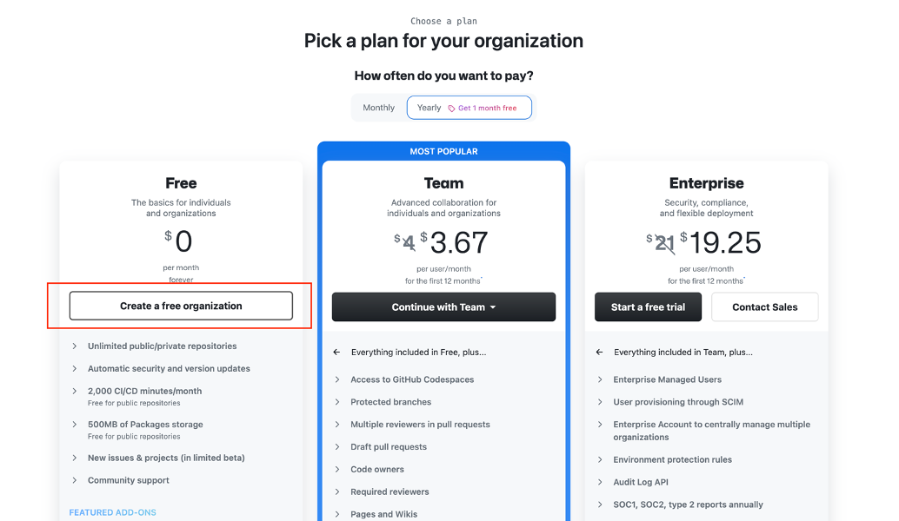

3.	Setup the newly created organization.

    a.	Organization account name can be set to any desired name.
    
    b.	Under contact email, enter your email address.
    
    c.	Ensure that the “organization belongs to” is set to be “My personal account”. (See screenshot below)
    
    d.	Accept Terms and Conditions and click “Next”.
    
    e.	After clicking next, you can add collaborators if you want. Otherwise skip the step that asks to add collaborators.
    
    f.	At this time, organization setup on GitHub shall be complete.

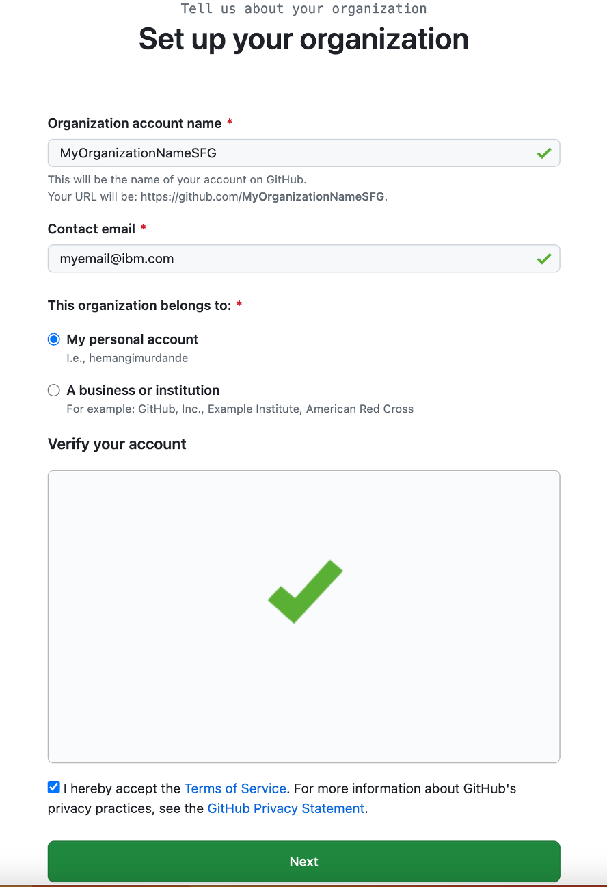

4.	Create a personal access token in GitHub. To link your GitHub organization to your TechZone environment, you will need a personal access token. To create a personal access token, follow the steps below.

    a.	Go to GitHub account settings 
    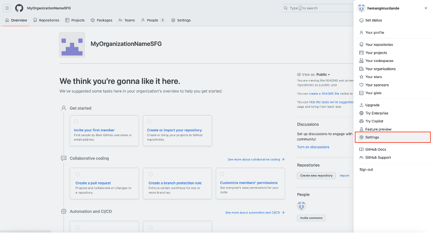
    
    b.	Scroll down in the list of settings and click on “Developer settings.”
    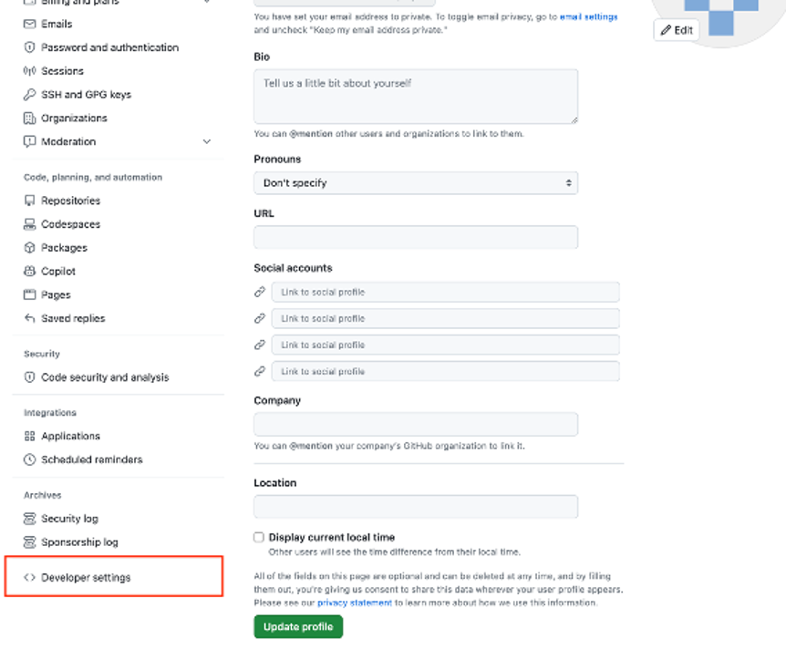
    
    c.	In Developer Settings, click on “Personal access tokens” and then click on “Tokens(classic)”
    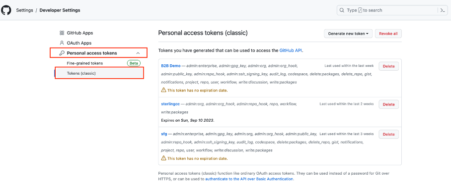

    d. Click on “Generate new token” button and then click on “Generate new token (classic)” 
    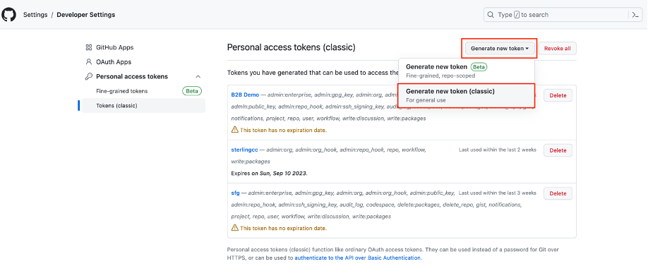

    e.	Add a note for this token and select desired expiration date based on how long you plan to use this environment. 
    Under select scopes, please grant 'repo', 'admin:repo_hook', 'admin:org_hook', and 'read:org' scopes to this token.
    
    Note: If you want, you can add more scopes for your token as well. The above list of scopes is the minimum required by TechZone in order to successfully deploy this environment.
    After selecting scopes, click “Generate Token”.
    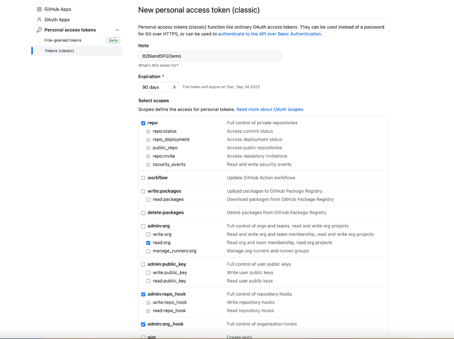

    f.	**Important**: Once token is generated, you will be able to see this token only once. So, when you see the token (greyed out in screenshot below), copy your token and save it. You will need this token when creating your TechZone environment.
    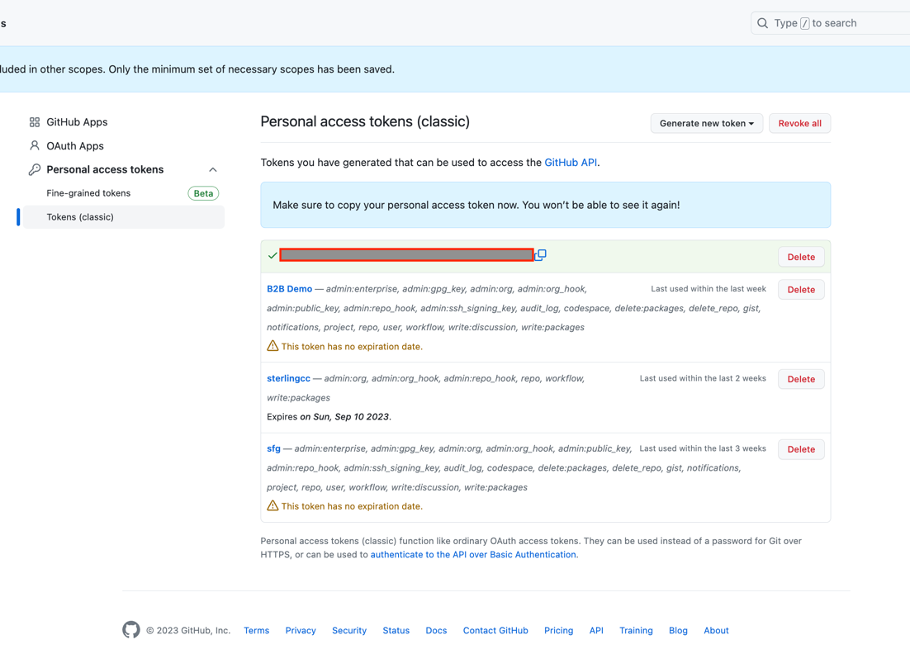

# Step 2: Reserve TechZone environment

1.	Login to your IBM Technology Zone Account
2.	In TechZone, search for “ROKS Cluster with GitOps Configuration”
3.	Reserve this environment (See screenshots below)
        
    a.	Purpose: This environment is not available for “Practice/Self Education” Purposes. So, you will need to enter “Customer Demo” as purpose and will need an opportunity number from IBM Sales Cloud to be able to reserve this environment. If you do not have an opportunity number, please contact your peers/manager to obtain the same.
    
    b.	Sales Opportunity Number: For this field, enter the opportunity number obtained from IBM Sales cloud.
    
    c.	Purpose Description: Elaborate on your purpose here.
    
    d.	Preferred Geography: Select the region that best identifies with your work location.
    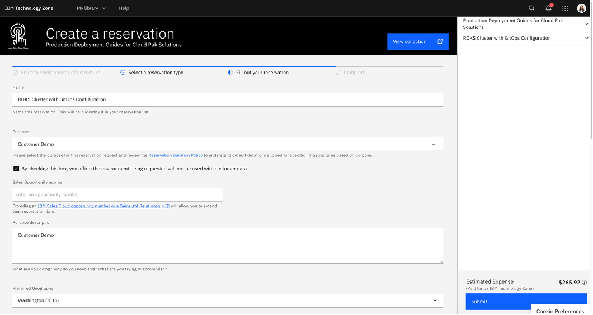
    
    e.	 End Date and Time: You can leave this as is. Generally, this environment will provide access for 4 days. Access can be extended later as needed.
    
    f.	Worker Node Count: Leave as “3”
    
    g.	Worker Node Flavor: Select “b3c.16x64.300gb (16 vCPU x 64GB – 300GB Secondary Storage)”
    
    h.	Public GitHub Access API token: Enter the personal access token that we created in Step 1 section 4 of this guide.
    
    i.	Public GitHub Org Name: Enter the name of your GitHub organization here (Same as stated in Step 1 section 3a).
    
    j.	Select NFS Size (required): Select “500GB”
    
    k.	OpenShift Version (required): Select “OpenShift 4.10
    
    l.	Click Submit
    
    m.	At this time, your TechZone environment Setup is complete. It may take a few hours for the environment to be provisioned and ready for next steps.
    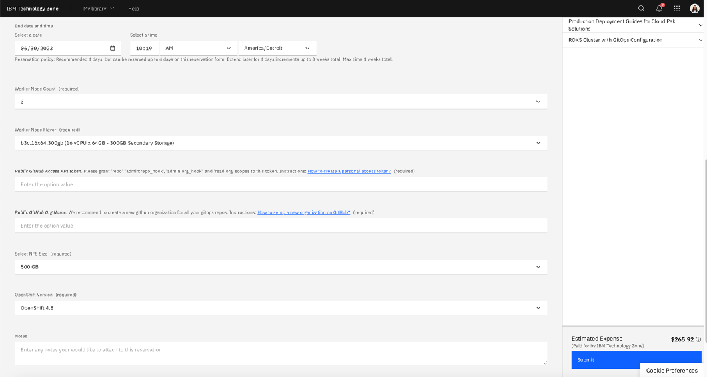

# Step 3: Deploy B2Bi and SFG
1.	Before proceeding with Step 3 ensure the following:
        
    a.	Your TechZone environment Status is “Ready” 
    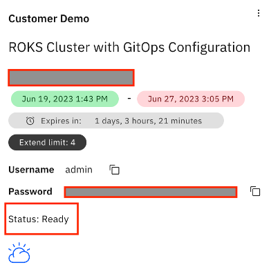
 
    b.	In your GitHub organization, you should now see the following 3 repositories.
    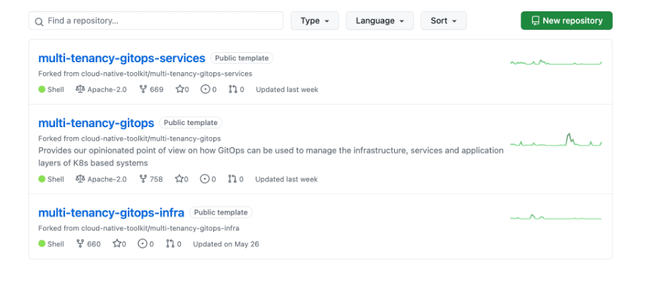

 

2.	Clone the 3 repositories on your local machine: multi-tenancy-gitops, multi-tenancy-gitops-services and multi-tenancy-gitops-infra.
3.	Go to the repository “multi-tenancy-gitops”.
4.	Click on the folder “doc”.
5.	Search for “sfg-recipe.md”
6.	Follow the steps defined in sfg-recipe.md file.
7.	After completing steps defined in sfg-recipe.md, you should have a successfully working deployment of B2Bi and SFG.

